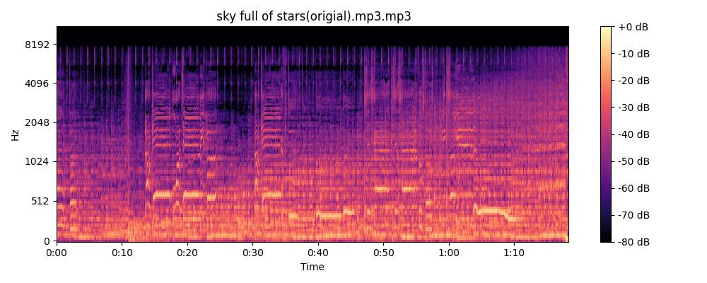
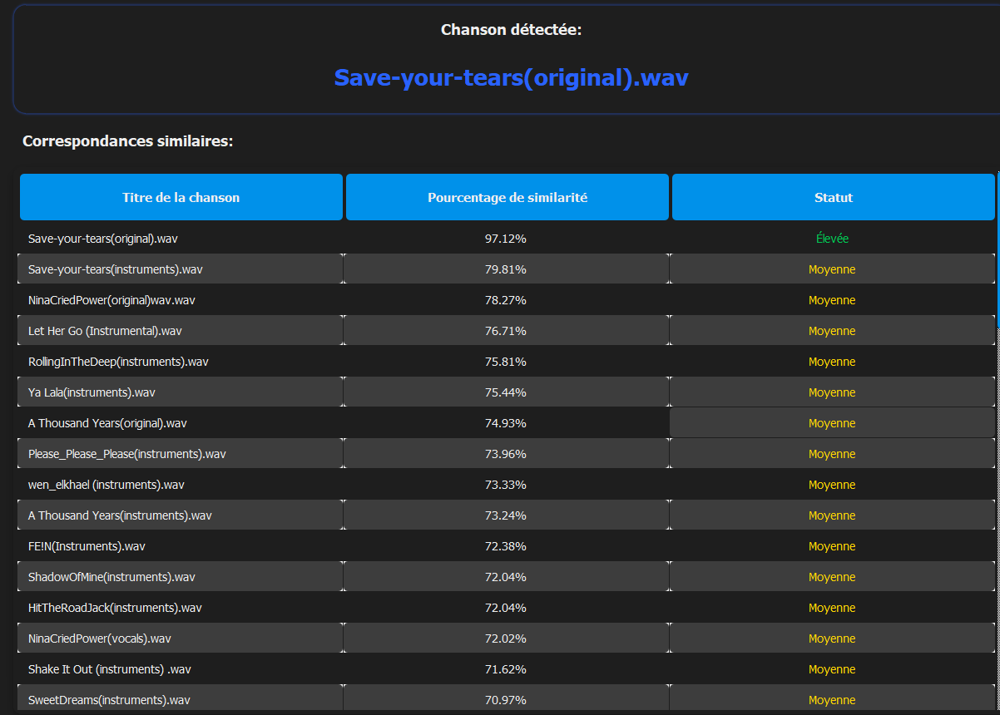
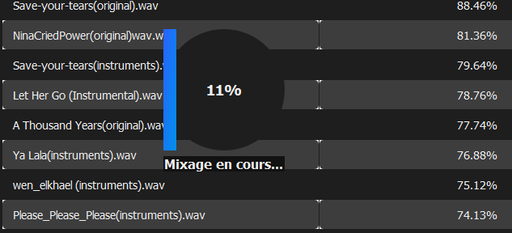
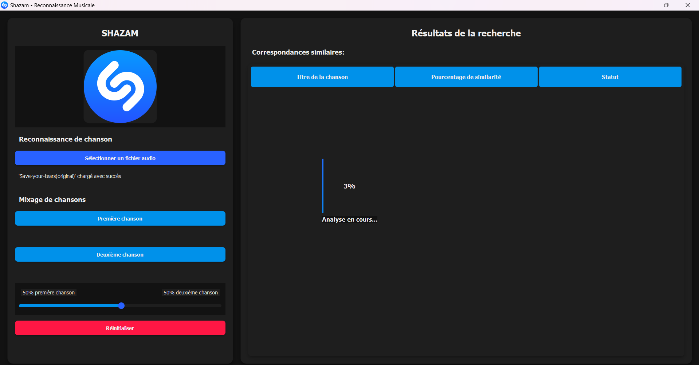
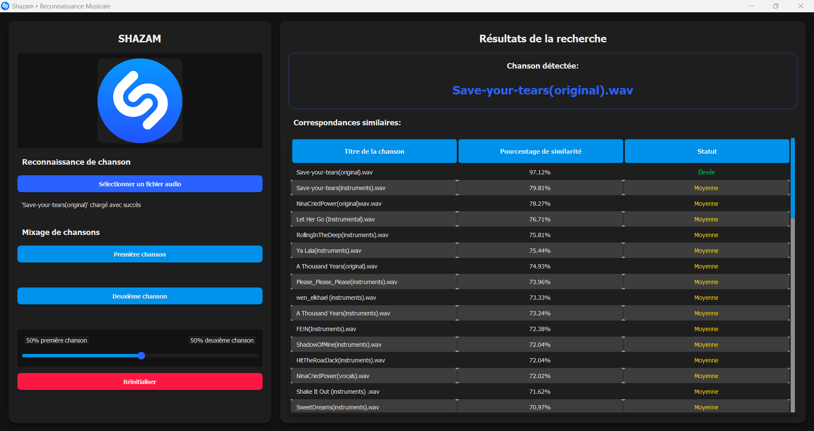

# 🎵 Shazam Low-Cost: Le Shazam du Pauvre 🤡


> **Pourquoi payer pour reconnaître une chanson quand on peut galérer gratuitement ?**

Ce projet est une tentative audacieuse (et probablement inutile) de recréer Shazam, mais en mode **low-cost**. Si vous avez toujours rêvé de souffrir en essayant de reconnaître une musique à partir de ses spectrogrammes et de tester des concepts de traitement du signal, vous êtes au bon endroit !

---

## 🎯 Objectif

L'objectif est simple : générer un spectrogramme, extraire des caractéristiques audio, les **hacher** (dans le bon sens du terme) et essayer de retrouver la chanson correspondante.

Bon, soyons honnêtes, c'est surtout un **prétexte pour tester des concepts en traitement du signal**... mais ça reste fun. 😆

---

## 🚀 Fonctionnalités

1. **Spectrogramme Express** 🎨
   - À partir de n'importe quel fichier audio (*mp3, wav*), on génère son **spectrogramme** pour les **30 premières secondes**.
   - On enregistre l'image du spectrogramme (ça sert à rien mais c'est joli).


2. **Extraction de Features** 🧐
   - On analyse le spectrogramme pour récupérer des **données intéressantes** comme le **centroïde spectral**, la **bande passante**, le **contraste spectral**, etc.
   - On applique un **hash perceptuel** pour générer une **empreinte audio unique**.

3. **Reconnaissance de Musique** 🔍
   - On compare l'empreinte audio avec celles stockées dans notre base de données.
   - On affiche les **musiques les plus similaires** avec un **score de similarité**.


4. **Fusion Audio Low-Cost™** 🎚️
   - Sélectionnez **deux fichiers audio**.
   - Créez un **mélange pondéré** des deux fichiers.
   - Générez une **nouvelle empreinte audio** et trouvez les morceaux qui s'en rapprochent.


---

## 🖥️ Interface

L'interface est développée avec **PyQt** pour un affichage simple et fonctionnel (on a essayé de ne pas faire moche). Voici à quoi ça ressemble :


---


---



---

## 🛠️ Installation

### 1️⃣ Cloner le repo
```bash
git clone https://github.com/Tiger-Foxx/shazam-low-cost.git
cd shazam-low-cost
```

### 2️⃣ Installer les dépendances
```bash
pip install -r requirements.txt
```

### 3️⃣ Lancer l'application
```bash
python main.py
```

---

## 📂 Structure du projet

```
shazam-low-cost/
│── fingerprints/       # Empreintes audios (hashs des features)
│── spectrograms/       # Images des spectrogrammes
│── data/               # Dossier contenant les fichiers audio
│── main.py             # Lancer l'application
│── spectrogram.py      # Génération des spectrogrammes
│── gui.py              # Interface utilisateur
│── utils.py            # Fonctions utilitaires
│── requirements.txt    # Liste des dépendances
│── README.md           # Ce magnifique fichier que tu lis
```

---

## ⚠️ Limitations

- La reconnaissance est **approximative**, c'est plus une démo qu'un outil sérieux.
- Les performances sont **dépendantes des données disponibles**.
- Pas d'algorithme de deep learning ici, **juste du traitement de signal**.

---

## 📜 Licence

Ce projet est sous licence **WTFPL** : *Faites-en ce que vous voulez, mais ne vous attendez pas à du support technique !* 😆


Bon test et bon amusement ! 🎧

